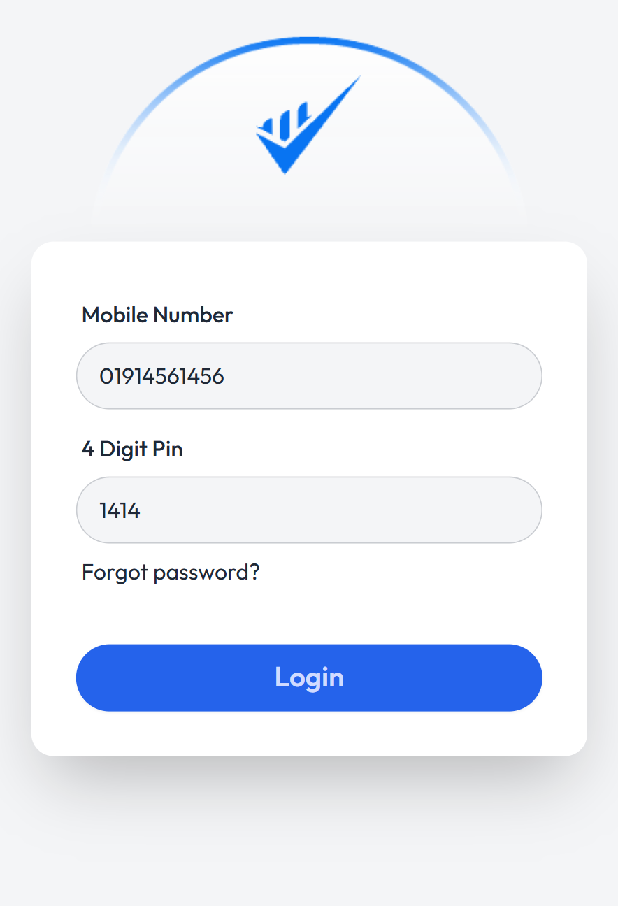
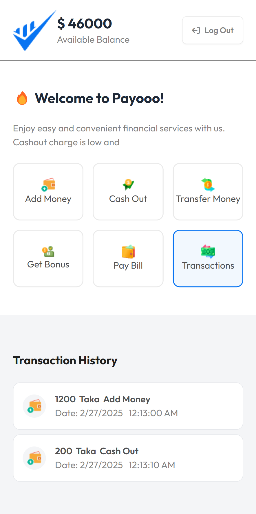
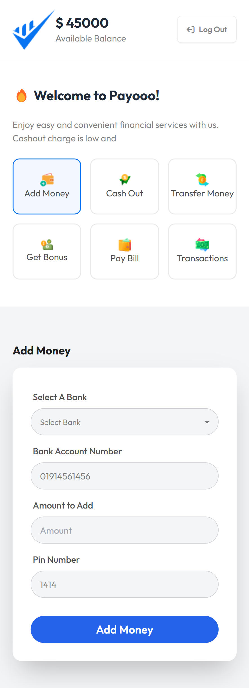

# Payooo Banking App

A simple banking application for mobile created for practice, utilizing HTML, CSS, Tailwind CSS, DaisyUI, and JavaScript. This app allows users to add money, cash out money, and view transaction history. Other features are included for visual purposes only and do not have functionality.

## Features

- **Add Money**: Increase the total money balance by adding funds.
- **Cash Out**: Decrease the total money balance by cashing out funds.
- **Transaction History**: View a history of all add money and cash out transactions.

## Technologies Used

- **HTML**
- **CSS**
- **Tailwind CSS**
- **DaisyUI**
- **JavaScript**

## Usage

1. **Add Money**:

   - Enter the amount you want to add.
   - Click the "Add Money" button.
   - The total money balance will increase by the entered amount.
   - The transaction will be recorded in the transaction history.

2. **Cash Out**:
   - Enter the amount you want to cash out.
   - Click the "Cash Out" button.
   - The total money balance will decrease by the entered amount.
   - The transaction will be recorded in the transaction history.

## Installation

1. Clone the repository:
   ```bash
   git clone https://github.com/yourusername/simple-banking-app.git
   ```

## A visual representation of my banking application.

<table>
  <tr>
    <td style="vertical-align: top;"></td>
    <td style="vertical-align: top;"></td>
  </tr>
  <tr>
    <td style="vertical-align: top;"></td>
    <td style="vertical-align: top;"></td>
  </tr>
  <tr>
    <td style="vertical-align: top;"></td>
    <td style="vertical-align: top;"></td>
  </tr>
</table>
